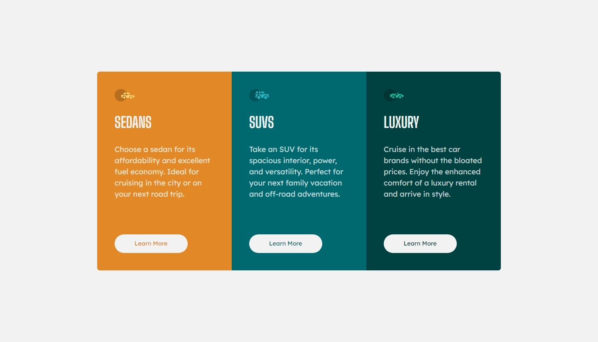

# Frontend Mentor - 3-column preview card component solution

This is a solution to the [3-column preview card component challenge on Frontend Mentor](https://www.frontendmentor.io/challenges/3column-preview-card-component-pH92eAR2-). Frontend Mentor challenges help you improve your coding skills by building realistic projects.

## Table of contents

- [Overview](#overview)
  - [The challenge](#the-challenge)
  - [Screenshots](#screenshot)
  - [Links](#links)
- [My process](#my-process)
  - [Built with](#built-with)
  - [What I learned](#what-i-learned)
  - [Useful resources](#useful-resources)

## Overview

### The challenge

Users should be able to:

- View the optimal layout depending on their device's screen size
- See hover states for interactive elements

### Screenshot

#### Mobile

|                                        Initial state                                        |                                            Hover state (over the buttons)                                            |
| :-----------------------------------------------------------------------------------------: | :------------------------------------------------------------------------------------------------------------------: |
|  |  |

#### Desktop

### Links

- Solution URL: [in this link.](https://your-solution-url.com)
- Live Site URL: [in this link.](https://your-live-site-url.com)

## My process

### Built with

- Semantic HTML5 markup
- CSS3
- Flexbox
- Grid

### What I learned

- The difference between `auto-fill` and `auto-fit` in grid layouts.

- The grid's container have to `overflow: hidden` in order to display its children `border-radius` properly.

- **Question**: It seems `border-box` is not working, at least for my 3 buttons. When I hover over the buttons, I set to display 2px all sides borders. As it happens, the whole container's height increases by 12px, which is not the expected behavior for a `border-box` element, right?

### Useful resources

- [CSS Tricks' `auto-fill` vs `auto-fit`.](https://css-tricks.com/auto-sizing-columns-css-grid-auto-fill-vs-auto-fit/#:~:text=If%20you%E2%80%99re%20using%20auto-fit%2C%20the%20content%20will%20stretch,them%2C%20thus%20affecting%20the%20size%2Fwidth%20of%20the%20latter.).

- [MDN's `border-box` definition](https://developer.mozilla.org/en-US/docs/Web/CSS/box-sizing).
