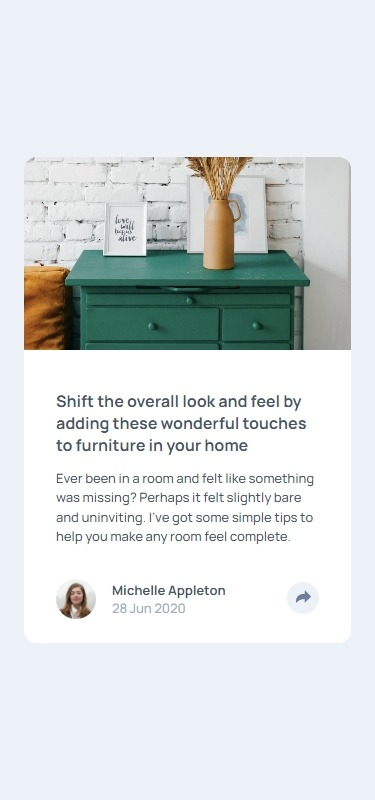
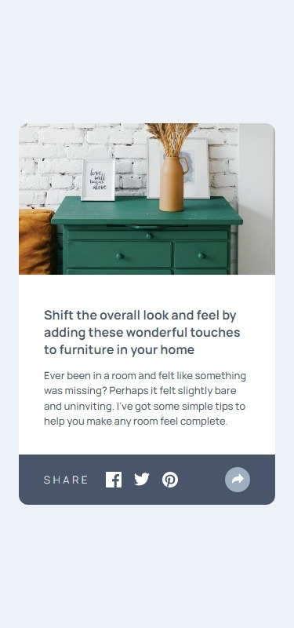
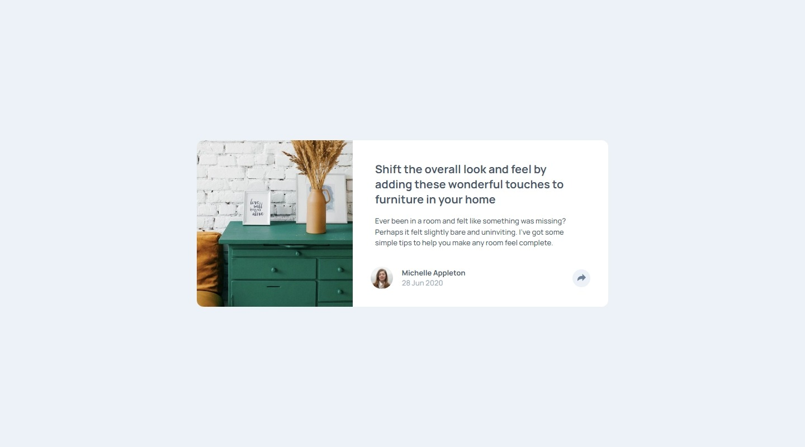
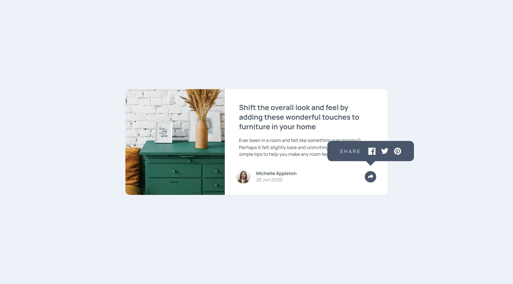

# Frontend Mentor - Article preview component solution

This is a solution to the [Article preview component challenge on Frontend Mentor](https://www.frontendmentor.io/challenges/article-preview-component-dYBN_pYFT). Frontend Mentor challenges help you improve your coding skills by building realistic projects.

## Table of contents

- [Overview](#overview)
  - [The challenge](#the-challenge)
  - [Screenshot](#screenshot)
  - [Links](#links)
- [My process](#my-process)
  - [Built with](#built-with)
  - [What I learned](#what-i-learned)
  - [Useful resources](#useful-resources)

## Overview

### The challenge

Users should be able to:

- View the optimal layout for the component depending on their device's screen size
- See the social media share links when they click the share icon

### Screenshot

#### Mobile

|                                              Initial state                                              |                                                          Activated states                                                           |
| :-----------------------------------------------------------------------------------------------------: | :---------------------------------------------------------------------------------------------------------------------------------: |
|  |  |

#### Desktop

|                                               Initial state                                               |                                                           Activated states                                                            |
| :-------------------------------------------------------------------------------------------------------: | :-----------------------------------------------------------------------------------------------------------------------------------: |
|  |  |

### Links

- [Solution URL](https://www.frontendmentor.io/solutions/hiddenvisible-box-transition-on-button-click-sstU8DeJPI)

- [Live Site URL](https://jvmdo.github.io/frontend-mentor-challenges/article-preview-component/)

## My process

### Built with

- Mobile-first workflow
- Semantic HTML5 markup
- CSS3
- Grid

### What I learned

- I was struggling trying to figure out why the image container's width did not match the image width. Its quite obvious but the theory escaped from my mind. There is a StackOverflow answer about it linked below.

- In order to make `object-fit` work, it is necessary either the image naturally be bigger then its container or set explicitly the image size using `width` and/or `height`. Note: `min-width: 100%` is not explicit.

- `object-position` is used to position a fitted image within its container.

- `grid-auto-flow: column` can be very helpful.

- I did a pseudo-element `transition` 😎😁

### Useful resources

- [SO answer about `div` width](https://stackoverflow.com/a/57600706/7631147)
