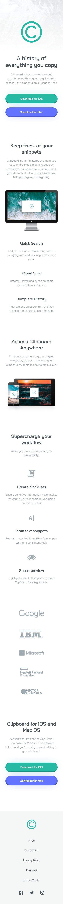
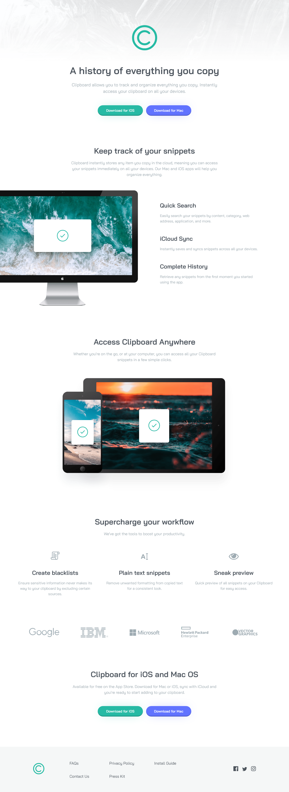

# Frontend Mentor - Clipboard landing page solution

This is a solution to the [Clipboard landing page challenge on Frontend Mentor](https://www.frontendmentor.io/challenges/clipboard-landing-page-5cc9bccd6c4c91111378ecb9). Frontend Mentor challenges help you improve your coding skills by building realistic projects.

## Table of contents

- [Overview](#overview)
  - [The challenge](#the-challenge)
  - [Screenshot](#screenshot)
  - [Links](#links)
- [My process](#my-process)
  - [Built with](#built-with)
  - [What I learned](#what-i-learned)

## Overview

### The challenge

Users should be able to:

- View the optimal layout for the site depending on their device's screen size
- See hover states for all interactive elements on the page

### Screenshot

#### Mobile

|                                       State: initial                                        |                                        State: hover over (buttons and links)                                         |
| :-----------------------------------------------------------------------------------------: | :------------------------------------------------------------------------------------------------------------------: |
|  |  |

#### Desktop

### Links

- [Solution URL](https://www.frontendmentor.io/solutions/simple-mobilefirst-full-webpage-layout-_bTtIJwI8l)

- [Live Site URL](https://jvmdo.github.io/frontend-mentor-challenges/clipboard-landing-page-master/)

## My process

### Built with

- Semantic HTML5 markup
- CSS3
- Flexbox for micro layouts.

### What I learned

- Negative margins can be used to overlap the parents's width constraints. I applied this technique to make the computer image overflows the page.

- Set `main`'s `max-width` instead of `body` because `header` and `footer` have to be full width even when the width of the page is greater than `max-width` constraint.

- Flexbox has no `justify-self` property but `margin-*: auto` can do the job.

- Make use of _inset_ `box-shadow`.
