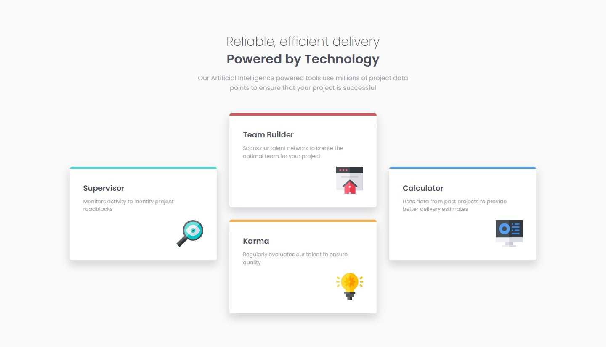
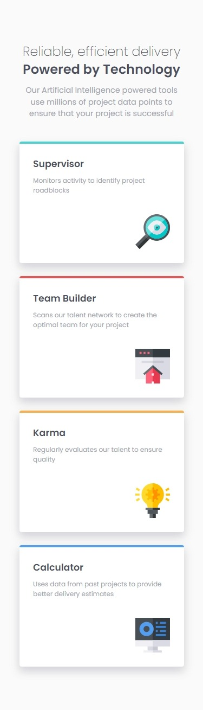

# Frontend Mentor - Four card feature section solution

This is a solution to the [Four card feature section challenge on Frontend Mentor](https://www.frontendmentor.io/challenges/four-card-feature-section-weK1eFYK). Frontend Mentor challenges help you improve your coding skills by building realistic projects.

## Table of contents

- [Overview](#overview)
  - [The challenge](#the-challenge)
  - [Screenshot](#screenshot)
  - [Links](#links)
- [My process](#my-process)
  - [Built with](#built-with)
  - [What I learned](#what-i-learned)

## Overview

### The challenge

Users should be able to:

- View the optimal layout for the site depending on their device's screen size

### Screenshot

#### Desktop

#### Mobile

### Links

- [Solution URL](https://www.frontendmentor.io/solutions/12column-grid-to-lay-cards-out-in-different-alignments-IQDG8o2xX7)

- [Live Site URL](https://jvmdo.github.io/frontend-mentor-challenges/four-card-feature-section/)

## My process

### Built with

- Semantic HTML5 markup
- CSS3
- Flexbox (main layout)
- Grid (card layout)

### What I learned

- Use of a 12-column grid to layout cards in different alignments.
