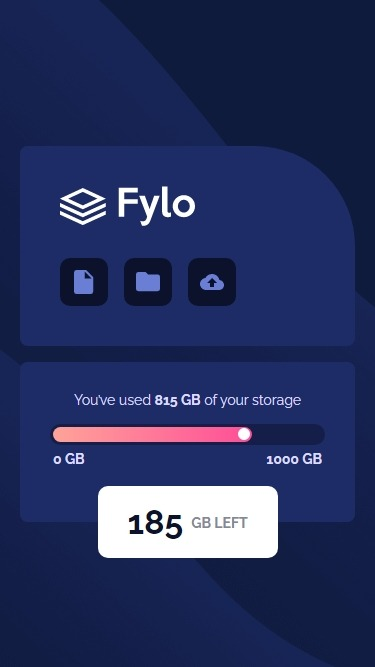
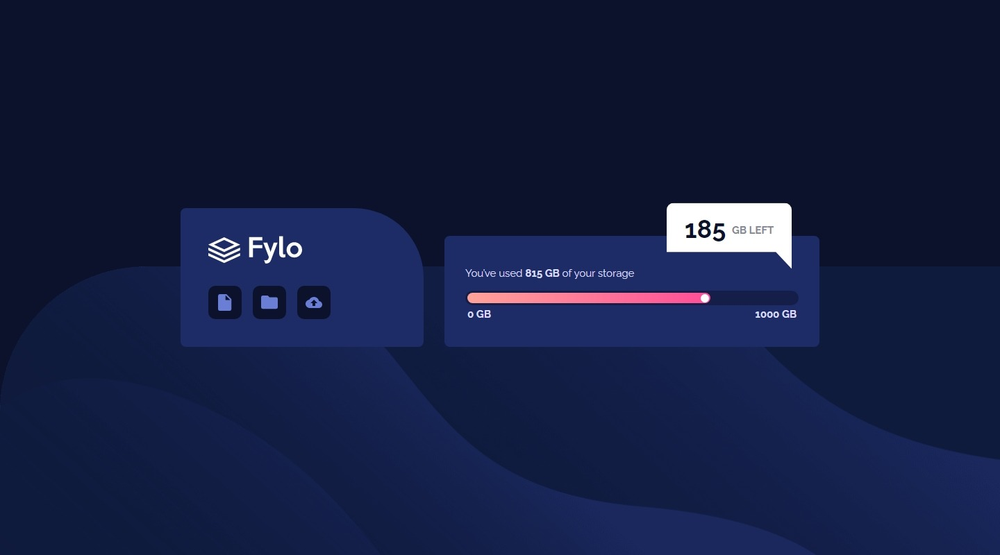

# Frontend Mentor - Fylo data storage component solution

This is a solution to the [Fylo data storage component challenge on Frontend Mentor](https://www.frontendmentor.io/challenges/fylo-data-storage-component-1dZPRbV5n). Frontend Mentor challenges help you improve your coding skills by building realistic projects.

## Table of contents

- [Overview](#overview)
  - [The challenge](#the-challenge)
  - [Screenshot](#screenshot)
  - [Links](#links)
- [My process](#my-process)
  - [Built with](#built-with)
  - [What I learned](#what-i-learned)
  - [Useful resources](#useful-resources)

## Overview

### The challenge

Users should be able to:

- View the optimal layout for the site depending on their device's screen size

### Screenshot

#### Mobile

#### Desktop

### Links

- [Solution URL](https://your-solution-url.com)
- [Live Site URL](https://your-live-site-url.com)

## My process

### Built with

- Mobile-first approach
- HTML5
- CSS3
- Flexbox

### What I learned

- `background-size: cover` requires HTML element to be `100vh` in order to fill up the whole page view height;

- Sometimes it is possible to use `Flexbox` in such a way that the component is responsive without using `media queries`.

- `clip-path: polygon()` for creation of many shapes.

- I could not apply styles to the `<meter>` element.

### Useful resources

- [CSS Trick's full page background.](https://css-tricks.com/perfect-full-page-background-image/#aa-css-only-technique-2)

- [Clippy tools.](https://bennettfeely.com/clippy/)

- [CSS Trick's meter styling.](https://css-tricks.com/html5-meter-element/)
