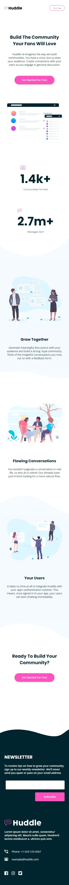
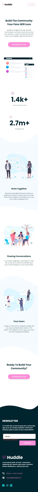
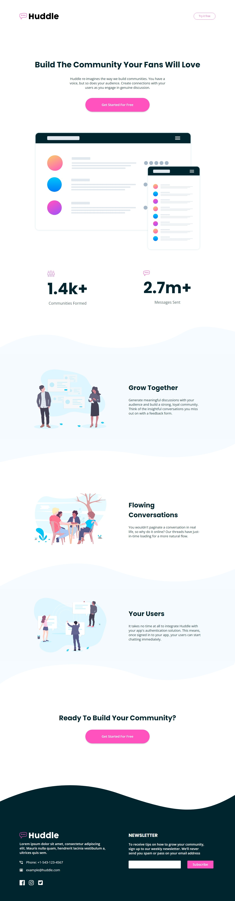

# Frontend Mentor - Huddle landing page with curved sections solution

This is a solution to the [Huddle landing page with curved sections challenge on Frontend Mentor](https://www.frontendmentor.io/challenges/huddle-landing-page-with-curved-sections-5ca5ecd01e82137ec91a50f2). Frontend Mentor challenges help you improve your coding skills by building realistic projects.

## Table of contents

- [Overview](#overview)
  - [The challenge](#the-challenge)
  - [Screenshot](#screenshot)
  - [Links](#links)
- [My process](#my-process)
  - [Built with](#built-with)
  - [What I learned](#what-i-learned)
  - [Useful resources](#useful-resources)

## Overview

### The challenge

Users should be able to:

- View the optimal layout for the site depending on their device's screen size
- See hover states for all interactive elements on the page

### Screenshot

#### Mobile

|                                            Initial state                                             |                                                         States activated                                                         |
| :--------------------------------------------------------------------------------------------------: | :------------------------------------------------------------------------------------------------------------------------------: |
|  |  |

#### Desktop

### Links

- Solution URL: [Add solution URL here](https://your-solution-url.com)
- Live Site URL: [Add live site URL here](https://your-live-site-url.com)

## My process

### Built with

- Mobile-first workflow
- Semantic HTML5 markup
- CSS3
- Flexbox
- Grid

### What I learned

- Make the semantic wrapper elements (`header`, `main`, `section`, `article`, `footer`) as wide as the viewport and use a `div.container` to actually wrap the content. This way, it is possible to set a `padding` equal for each portion of content, set a different padding using a transparent `border` and make them all horizontally centered using `margin: auto`;

- Group several SVG images with `<symbol>` in a single file then using them with `<use>`. This way is easier to change their `fill` colors. It's also possible to use custom variables.

- The `div.container` makes possible to apply curved background technique, which is based on padding space combined with pseudo-element. The result is a fully responsible curved background.

- Maybe a better way to use images in grid/flexbox is to wrap it inside `
`. The div respect the grid/flexbox sizing whilst image width is explicitly set.

### Useful resources

- [Sprite SVG](http://svgsprit.es/) - Sprite them to use `<symbol>`.
