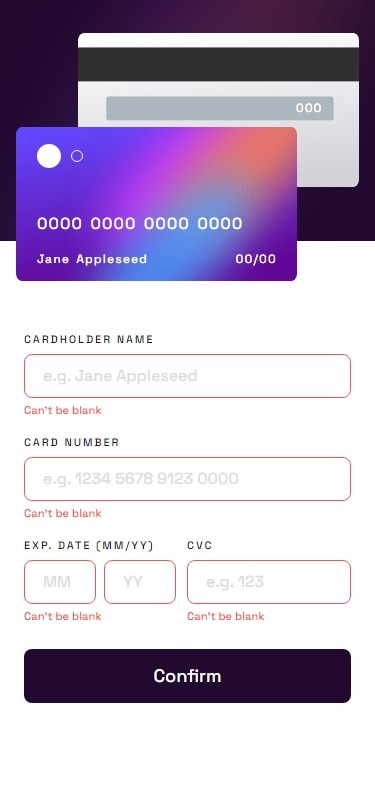
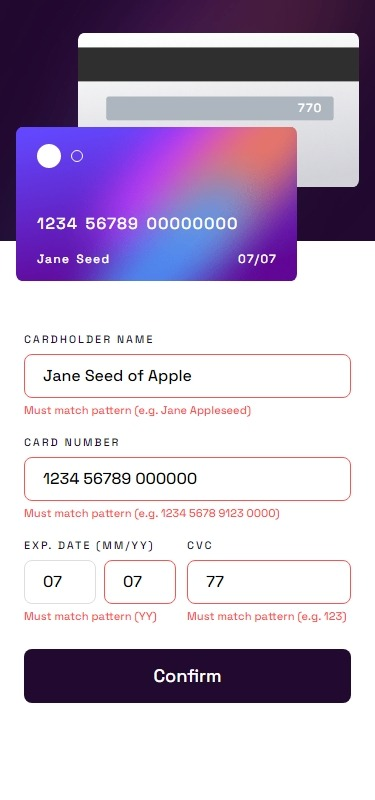

# Frontend Mentor - Interactive card details form solution

This is a solution to the [Interactive card details form challenge on Frontend Mentor](https://www.frontendmentor.io/challenges/interactive-card-details-form-XpS8cKZDWw). Frontend Mentor challenges help you improve your coding skills by building realistic projects.

## Table of contents

- [Overview](#overview)
  - [The challenge](#the-challenge)
  - [Screenshot](#screenshot)
  - [Links](#links)
- [My process](#my-process)
  - [Built with](#built-with)
  - [Continued development](#continued-development)
  - [Useful resources](#useful-resources)
  - [Comments](#comments)
- [Run it on your machine](#run-it-on-your-machine)

## Overview

### The challenge

Users should be able to:

- Fill in the form and see the card details update in real-time
- Receive error messages when the form is submitted if:
  - Any input field is empty
  - The card number, expiry date, or CVC fields are in the wrong format
- View the optimal layout depending on their device's screen size
- See hover, active, and focus states for interactive elements on the page

### Screenshot

#### Mobile

|                                              Initial state                                              |                                                         Active states                                                         |                                                        Active states 2                                                         | Submit page                                                                                                          |
| :-----------------------------------------------------------------------------------------------------: | :---------------------------------------------------------------------------------------------------------------------------: | :----------------------------------------------------------------------------------------------------------------------------: | -------------------------------------------------------------------------------------------------------------------- |
|  |  |  |  |

#### Desktop

|                                               Initial state                                               |                                                          Submit page                                                           |
| :-------------------------------------------------------------------------------------------------------: | :----------------------------------------------------------------------------------------------------------------------------: |
|  |  |

### Links

- [Solution URL](https://your-solution-url.com)

- [Live Site URL](https://your-live-site-url.com)

## My process

### Built with

- Mobile-first workflow
- Semantic HTML5 markup
- CSS3
- Grid

### What I learned

- How to use fluid spacing for grid tracks.

- How to make a fluid box that grows into the grid respecting a given `aspect-ratio`.

- Make a post request using JavaScript instead of using the default `form` method.

- How to use Cleave, a simple JavaScript library, to format input fields in real-time.

- How to update the UI according to the values typed in the fields in real-time.

### Continued development

- How to import Cleave?

- Custom properties and methods for HTMLElements on JavaScript

- Fetch requests

### Useful resources

- [Cleave GitHub's repository](https://github.com/nosir/cleave.js)

## Acknowledgments

- This answer on StackOverflow helped on [how to set a `linear-gradient()` as `border`](https://stackoverflow.com/a/51496341/7631147).

- This other one gave me a tip on [how to properly set a single `label` to two different `input` fields](https://stackoverflow.com/a/31274644/7631147).

### Comments

- Since Cleave year's [minDate] property does not work as I expected and taking into account that the minimum year set on HTML `pattern` input is 22, the validation keeps showing "Must match pattern (YY)" whenever the entered value is less than 22.

- Two separated inputs for MM/YY just make things harder!

- Set the background image width using percentage it is not that good because it "shrinks" as the viewport's width grow and don't respect zoom in/out also.

- The credit card number pattern differs depending on the card flag. The 0000 0000 0000 0000 pattern is owned by Visa and MasterCard for example.

## Run it on your machine

It need a local server to work properly since because of the form post request. "Live preview" VS Code extension is sufficient for that task.
