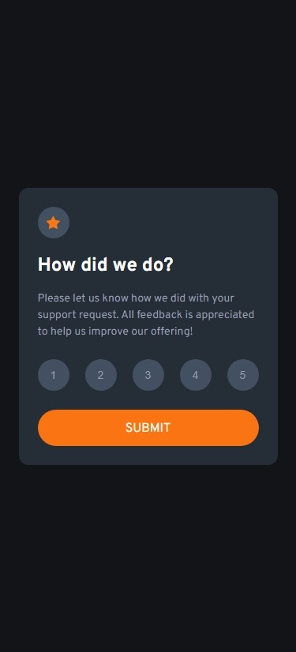
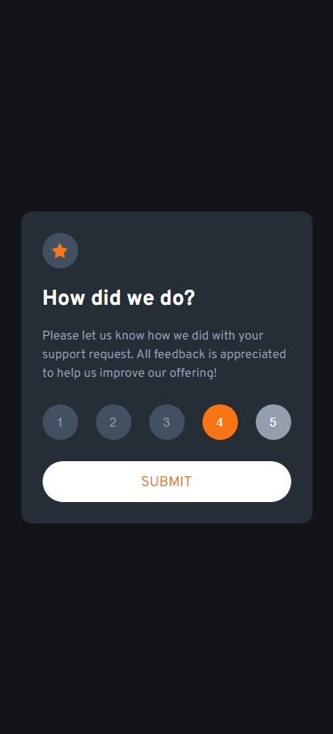
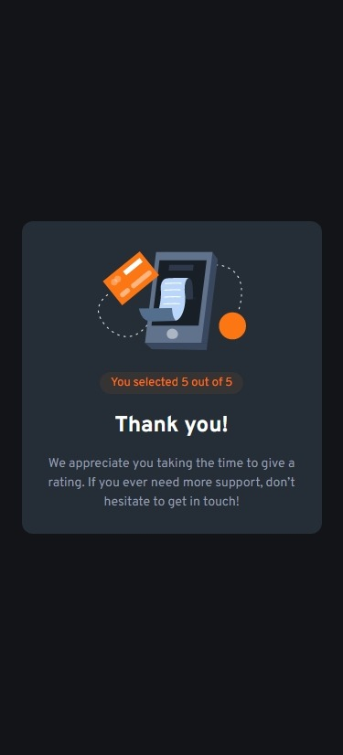
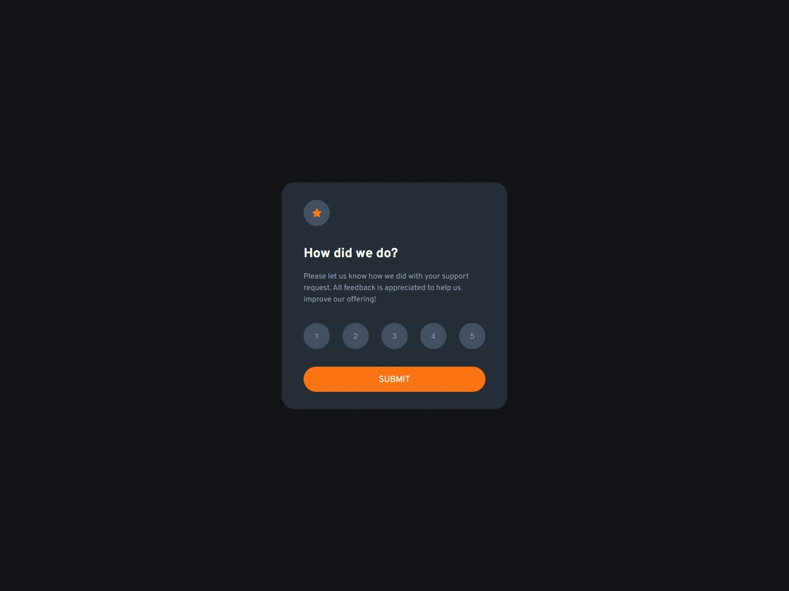
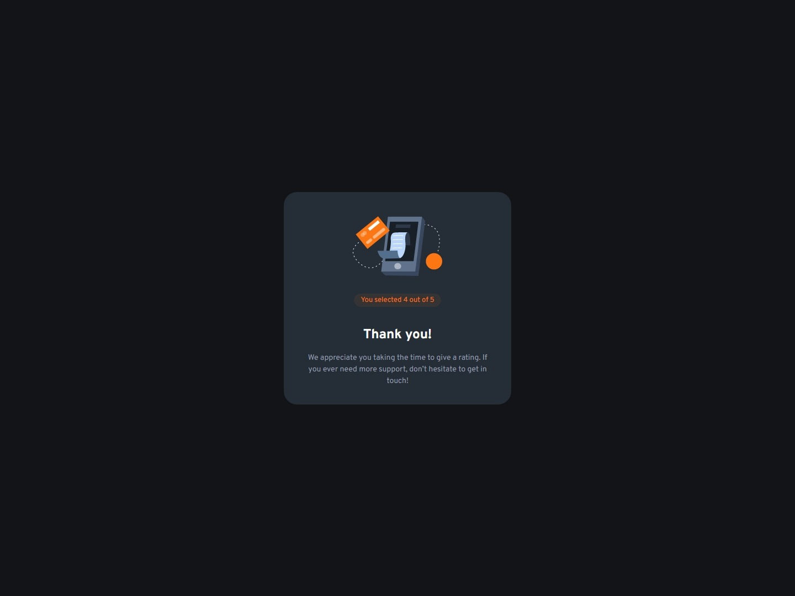

# Frontend Mentor - Interactive rating component solution

This is a solution to the [Interactive rating component challenge on Frontend Mentor](https://www.frontendmentor.io/challenges/interactive-rating-component-koxpeBUmI). Frontend Mentor challenges help you improve your coding skills by building realistic projects.

## Table of contents

- [Overview](#overview)
  - [The challenge](#the-challenge)
  - [Screenshot](#screenshot)
  - [Links](#links)
- [My process](#my-process)
  - [Built with](#built-with)
  - [What I learned](#what-i-learned)

## Overview

### The challenge

Users should be able to:

- View the optimal layout for the app depending on their device's screen size
- See hover states for all interactive elements on the page
- Select and submit a number rating
- See the "Thank you" card state after submitting a rating

### Screenshot

#### Mobile

|                                              Initial state                                              |                                                         Active states                                                         |                                                     Submit page                                                      |
| :-----------------------------------------------------------------------------------------------------: | :---------------------------------------------------------------------------------------------------------------------------: | :------------------------------------------------------------------------------------------------------------------: |
|  |  |  |

#### Desktop

|                                               Initial state                                               |                                                          Submit page                                                           |
| :-------------------------------------------------------------------------------------------------------: | :----------------------------------------------------------------------------------------------------------------------------: |
|  |  |

### Links

- [Solution URL](https://www.frontendmentor.io/solutions/passing-custom-styled-radio-buttons-data-through-url-params-mP0WP18Cp1)

- [Live Site URL](https://jvmdo.github.io/frontend-mentor-challenges/interactive-rating-component-main/)

## My process

### Built with

- Mobile-first workflow
- Semantic HTML5 markup
- CSS3

### What I learned

- `min-heigh` does not explicitly set the height of a container, hence it child has no height as well. The child must `min-height: inherit` in order to match its parent height.

- Custom style radio buttons combined with pseudo-elements. The secret relies on `appearance: none`.

- How to check programmatically whether some form's radio button was checked or not, then display some error message.

- Set `max-width` on the card container so it can shrink on smaller screens.

- How to get data passed from one page to another through form submission. The GET method populates the URL using the values from provides by the form. Then, the other page can use:

```javascript
const value = new URLSearchParams(location.search).get("value");
```

- It is also possible to use `localStorage` for the same purpose.
