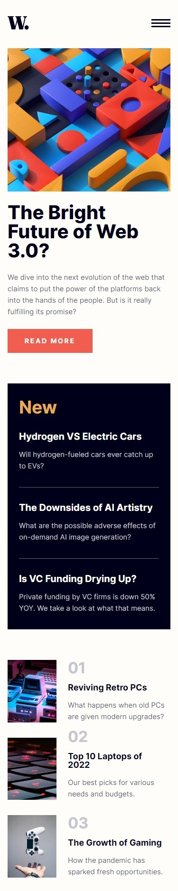
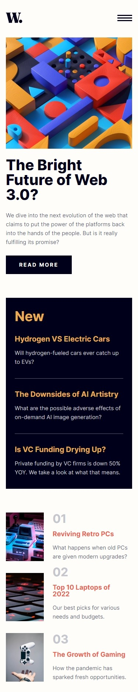
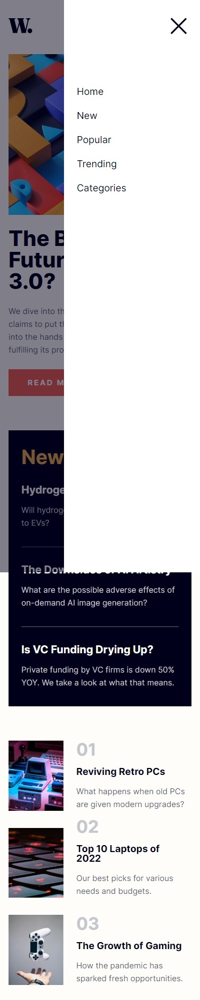
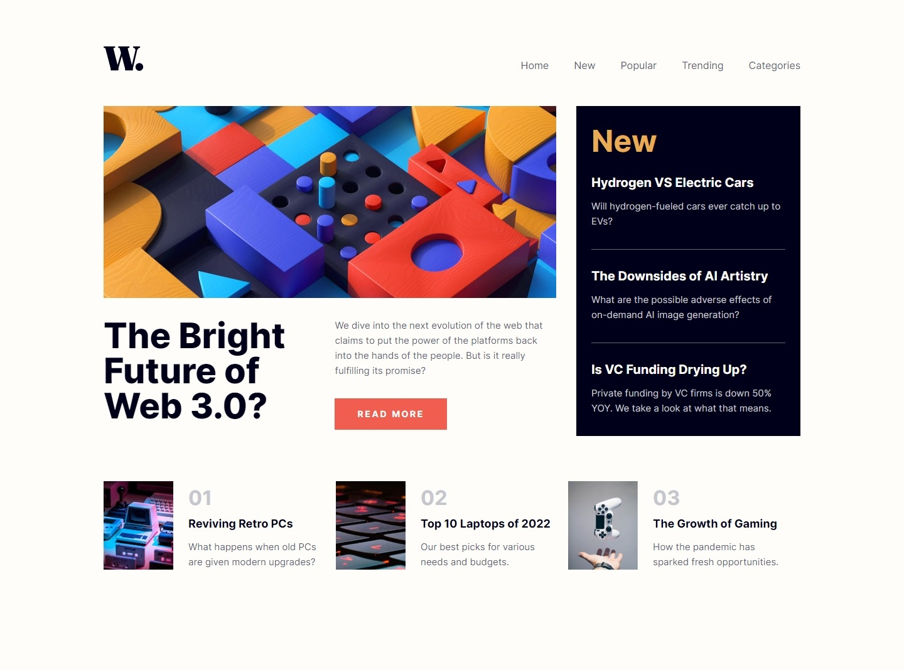

# Frontend Mentor - News homepage solution

This is a solution to the [News homepage challenge on Frontend Mentor](https://www.frontendmentor.io/challenges/news-homepage-H6SWTa1MFl). Frontend Mentor challenges help you improve your coding skills by building realistic projects.

## Table of contents

- [Overview](#overview)
  - [The challenge](#the-challenge)
  - [Screenshot](#screenshot)
  - [Links](#links)
- [My process](#my-process)
  - [Built with](#built-with)
  - [What I learned](#what-i-learned)

## Overview

### The challenge

Users should be able to:

- View the optimal layout for the interface depending on their device's screen size
- See hover and focus states for all interactive elements on the page
- **Bonus**: Toggle the mobile menu (requires some JavaScript)

### Screenshot

#### Mobile

|                                        Initial state                                        |                                                     Hover state                                                      |                                                      Menu Open                                                      |
| :-----------------------------------------------------------------------------------------: | :------------------------------------------------------------------------------------------------------------------: | :-----------------------------------------------------------------------------------------------------------------: |
|  |  |  |

#### Desktop

### Links

- [Solution URL](https://www.frontendmentor.io/solutions/grid-layout-and-simple-side-menu-toggle-O0TQmJShVW)

- [Live Site](https://jvmdo.github.io/frontend-mentor-challenges/news-homepage-main/)

## My process

### Built with

- Mobile-first workflow
- Semantic HTML5 markup
- CSS3
- Grid

### What I learned

- Use of CSS `counter()` combined with `::before` pseudo-element in order to create fancy styled numbered list.

- Responsiveness from 320px to 1440px. Watch out the `minmax()` grid because it can be the cause of an unexpected overflow on narrower screens.

- How to display a side menu that is initially hidden. I applied a `transition` but unfortunately it only works on menu open. The closing happens suddenly as soon as the toggle button is clicked.

- Grid percentages are not the bad.

- Use of `::before`, `inset: 0` and `translate()` combined to create a box-shadow like effect for the side menu.

- How to toggle a class from an element using JavaScript.

- How to use `mediaMatch` DOM API to dynamically close the menu.

- There are differences between `.firstChild()` and `.firstElementChild()` DOMElement methods.

#### Need for improvement

- The open/close menu transition.

- The side menu height is equal to the total screen height. Therefore, if the user scrolls down, he/she can see the end of us all.

#### Add features?

- Underscore opening transition on side menu links?

- Toggle button animation?
