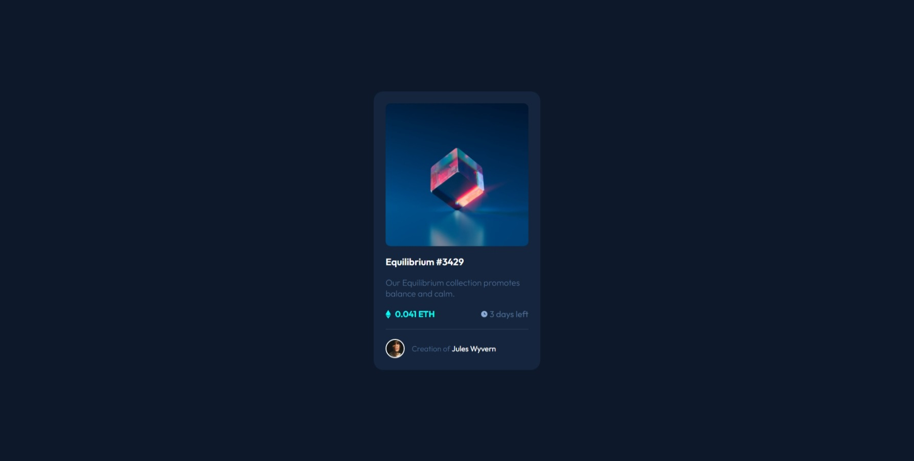

# Frontend Mentor - NFT preview card component solution

This is a solution to the [NFT preview card component challenge on Frontend Mentor](https://www.frontendmentor.io/challenges/nft-preview-card-component-SbdUL_w0U). Frontend Mentor challenges help you improve your coding skills by building realistic projects.

## Table of contents

- [Overview](#overview)
  - [The challenge](#the-challenge)
  - [Screenshot](#screenshot)
  - [Links](#links)
- [My process](#my-process)
  - [Built with](#built-with)
  - [What I learned](#what-i-learned)
  - [Useful resources](#useful-resources)

## Overview

### The challenge

Users should be able to:

- View the optimal layout depending on their device's screen size
- See hover states for interactive elements

### Screenshot

#### Mobile

|                                        Initial state                                        |                                             Hover state (over the image)                                             |
| :-----------------------------------------------------------------------------------------: | :------------------------------------------------------------------------------------------------------------------: |
|  |  |

#### Desktop



### Links

- Solution URL [in this link.](https://www.frontendmentor.io/solutions/flexbox-for-card-layout-and-grid-for-overlap-elements-cW3zD9rKhL)

- Live Site URL: [in this link.](https://jvmdo.github.io/frontend-mentor-challenges/nft-preview-card-component/)

## My process

### Built with

- Semantic HTML5 markup
- CSS3 simple
- Flexbox for cards' layout
- Grid for overlap elements

### What I learned

1. `Grid` to overlap elements.

2. Simple `transition` animation between two states.

3. Hover over pass through ancestor element using `pointer-events`.

4. Flexbox's `align-items` property reduces the container's flex item size to fit its content.
   For example, if I set

```css
main {
  align-items: flex-start;
}
```

then the full width behavior of the `ul` block element is disabled. In this case, I'd use

```css
ul {
  width: 100%;
}
```

to fill up all the horizontal space, which I didn't liked. I've figure it out later so the previous snippet was removed.

### Useful resources

- [Overlapping elements with `grid`.](https://audreesteinberg.medium.com/overlapping-html-elements-using-css-grid-f401262a4486)

- [`transition` property on MDN.](https://developer.mozilla.org/en-US/docs/Web/CSS/transition)

- [Stack Overflow answer about `pointer-event`.](https://stackoverflow.com/a/9739105)
