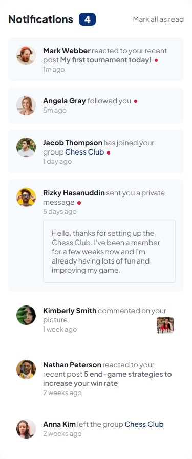
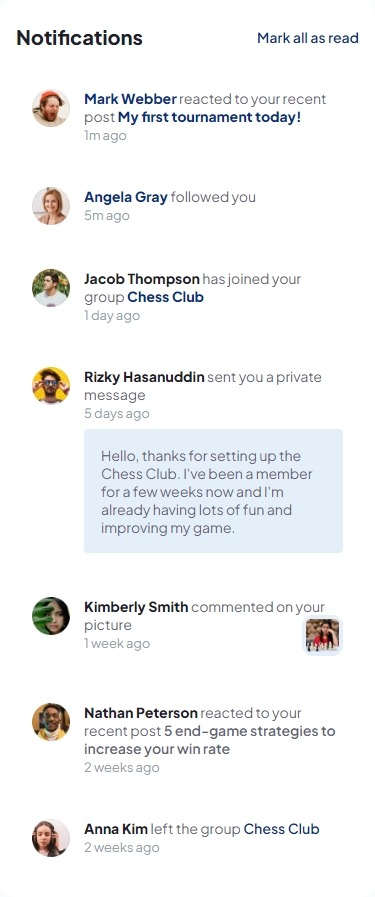
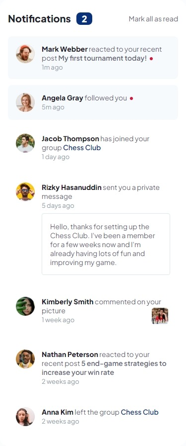
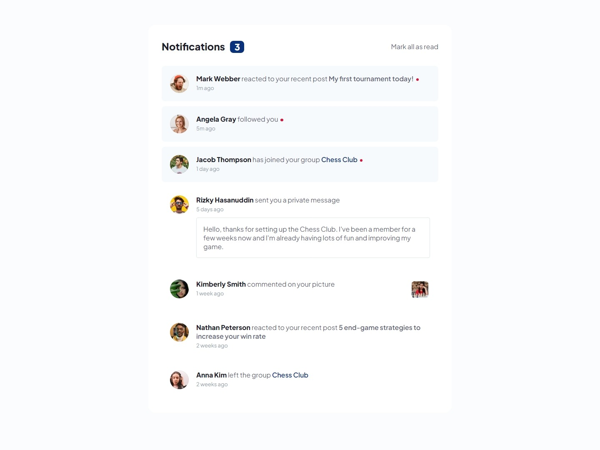

# Frontend Mentor - Notifications page solution

This is a solution to the [Notifications page challenge on Frontend Mentor](https://www.frontendmentor.io/challenges/notifications-page-DqK5QAmKbC). Frontend Mentor challenges help you improve your coding skills by building realistic projects.

## Table of contents

- [Overview](#overview)
  - [The challenge](#the-challenge)
  - [Screenshot](#screenshot)
  - [Links](#links)
- [My process](#my-process)
  - [Built with](#built-with)
  - [What I learned](#what-i-learned)

## Overview

### The challenge

Users should be able to:

- Distinguish between "unread" and "read" notifications
- Select "Mark all as read" to toggle the visual state of the unread notifications and set the number of unread messages to zero
- View the optimal layout for the interface depending on their device's screen size
- See hover and focus states for all interactive elements on the page

### Screenshot

#### Mobile

|                                              Initial state                                              |                                                         Active states                                                         |                                                  Mark as read (2)                                                  |
| :-----------------------------------------------------------------------------------------------------: | :---------------------------------------------------------------------------------------------------------------------------: | :----------------------------------------------------------------------------------------------------------------: |
|  |  |  |

#### Desktop

### Links

- [Solution URL](https://your-solution-url.com)

- [Live Site URL](https://your-live-site-url.com)

## My process

### Built with

- Mobile-first workflow
- Semantic HTML5 markup
- CSS3

### What I learned

- **Do not trust in floated images**. I worked out my `.notification` HTML in such a way that neither `float` nor `flex` could helped me positioning the inner picture.

- `:focus` is not working for `<strong>` and `` elements. Why? I'm searching for answers later...
