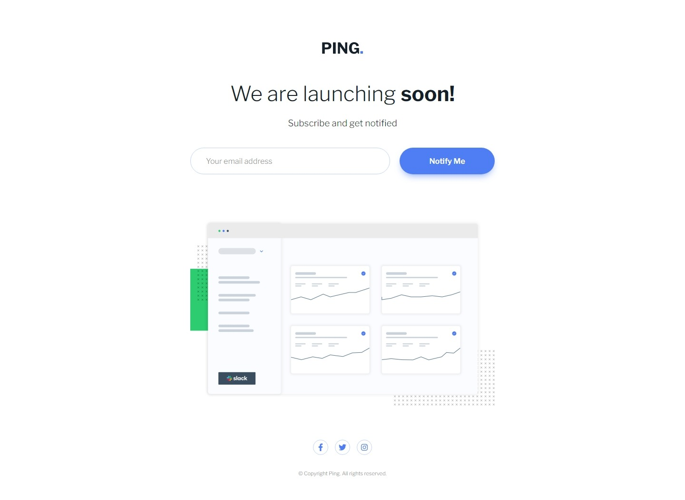

# Frontend Mentor - Ping coming soon page solution

This is a solution to the [Ping coming soon page challenge on Frontend Mentor](https://www.frontendmentor.io/challenges/ping-single-column-coming-soon-page-5cadd051fec04111f7b848da). Frontend Mentor challenges help you improve your coding skills by building realistic projects.

## Table of contents

- [Overview](#overview)
  - [The challenge](#the-challenge)
  - [Screenshot](#screenshot)
  - [Links](#links)
- [My process](#my-process)
  - [Built with](#built-with)
  - [What I learned](#what-i-learned)
  - [Useful resources](#useful-resources)

## Overview

### The challenge

Users should be able to:

- View the optimal layout for the site depending on their device's screen size
- See hover states for all interactive elements on the page
- Submit their email address using an `input` field
- Receive an error message when the `form` is submitted if:
  - The `input` field is empty. The message for this error should say _"Whoops! It looks like you forgot to add your email"_
  - The email address is not formatted correctly (i.e. a correct email address should have this structure: `name@host.tld`). The message for this error should say _"Please provide a valid email address"_

### Screenshot

#### Mobile

|                                              Initial state                                              |                                                          Activated states                                                           |
| :-----------------------------------------------------------------------------------------------------: | :---------------------------------------------------------------------------------------------------------------------------------: |
|  |  |

#### Desktop



### Links

- [Solution URL](https://your-solution-url.com)

- [Live Site URL](https://your-live-site-url.com)

## My process

### Built with

- Mobile-first workflow
- Semantic HTML5 markup
- CSS3
- Flexbox

### What I learned

- How to `clamp()` space that shrinks instead of grows. The following space shrinks from MAX to MIN:

  ```css
  margin: calc(-1 * clamp(-MAX, -BASE + VW, -MIN));
  ```

  The key point is to use the symmetric value (i.e, the negative) then multiply by `-1` to get back to positive.

- Yet another opportunity to `<use>` SVG symbols.

- Fresh remind on how to apply `flexbox` to create media queries-free micro layouts. Check out the great article linked below!

### Useful resources

- [An Interactive Guide to Flexbox by Josh Comeau](https://www.joshwcomeau.com/css/interactive-guide-to-flexbox/?utm_source=pocket_saves)
