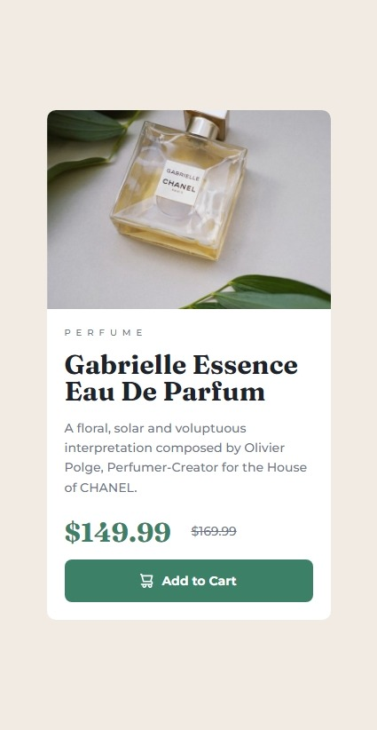
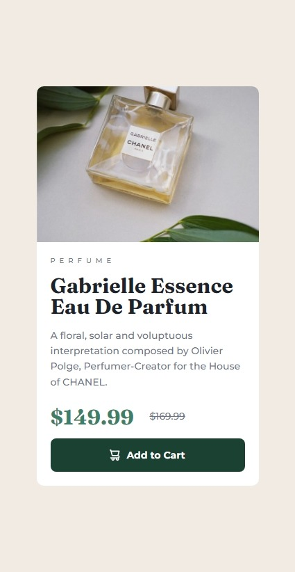

# Frontend Mentor - Product preview card component solution

This is a solution to the [Product preview card component challenge on Frontend Mentor](https://www.frontendmentor.io/challenges/product-preview-card-component-GO7UmttRfa). Frontend Mentor challenges help you improve your coding skills by building realistic projects.

## Table of contents

- [Overview](#overview)
  - [The challenge](#the-challenge)
  - [Screenshot](#screenshot)
  - [Links](#links)
- [My process](#my-process)
  - [Built with](#built-with)
  - [What I learned](#what-i-learned)
  - [Useful resources](#useful-resources)

## Overview

### The challenge

Users should be able to:

- View the optimal layout depending on their device's screen size
- See hover and focus states for interactive elements

### Screenshot

#### Mobile

|                                        Initial state                                        |                                            Hover state (over the button)                                             |
| :-----------------------------------------------------------------------------------------: | :------------------------------------------------------------------------------------------------------------------: |
|  |  |

#### Desktop


### Links

- Solution URL: [Add solution URL here](https://your-solution-url.com)
- Live Site URL: [Add live site URL here](https://your-live-site-url.com)

## My process

### Built with

- Semantic HTML5 markup
- CSS3
- Flexbox for card text
- Grid for desktop two column layout
- Mobile-first workflow

### What I learned

1. Clip a wrapper's child image borders by using

```css
.wrapper {
  overflow: auto;
}
```

2. Vertically centering an wrapper's `inline` child with

```css
.child {
  display: inline;
  line-height: 1;
  vertical-align: 50%;
}
```

3. `::before` pseudo-element to add an icon into buttons

```css
button::before {
  content: "";
  background: url("path/to/icon.svg") no-repeat left;
  padding: 20px;
}
```

### Useful resources

- [Stack Overflow answer about wrapper's `border-radius` clip.](https://stackoverflow.com/a/8582304)
- [`vertical-align` property on MDN.](https://developer.mozilla.org/en-US/docs/Web/CSS/vertical-align)
