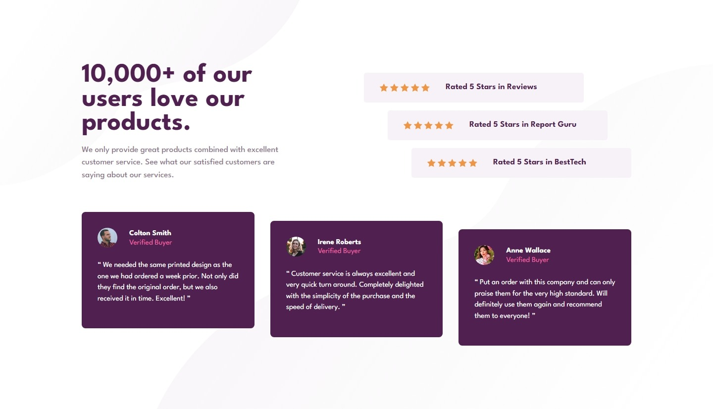
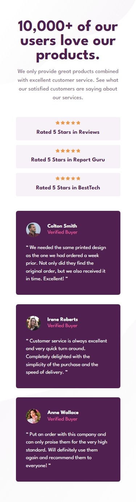

# Frontend Mentor - Social proof section solution

This is a solution to the [Social proof section challenge on Frontend Mentor](https://www.frontendmentor.io/challenges/social-proof-section-6e0qTv_bA). Frontend Mentor challenges help you improve your coding skills by building realistic projects.

## Table of contents

- [Overview](#overview)
  - [The challenge](#the-challenge)
  - [Screenshots](#screenshot)
  - [Links](#links)
- [My process](#my-process)
  - [Built with](#built-with)
  - [What I learned](#what-i-learned)
  - [Useful resources](#useful-resources)

## Overview

### The challenge

Users should be able to:

- View the optimal layout for the section depending on their device's screen size

### Screenshot

#### Desktop

#### Mobile

### Links

- [Solution URL](https://www.frontendmentor.io/solutions/flexbox-with-multiple-items-alignment-card-lcsDoIHfmm)

- [Live Site URL](https://github.com/jvmdo/frontend-mentor-challenges/tree/main/social-proof-section)

## My process

### Built with

- Semantic HTML5 markup
- CSS3 only
- Flexbox

### What I learned

- Flexbox is very useful even when the layout seems to need a grid. Applying `flex-wrap: wrap` can sometimes be the answer.

- It's ALWAYS important review the two layouts before getting into code. I had not realize the stars inside the rating list can't be `list-style-type` until I get into mobile layout.

### Useful resources

- [MDN's reference for styling lists](https://developer.mozilla.org/en-US/docs/Learn/CSS/Styling_text/Styling_lists).
