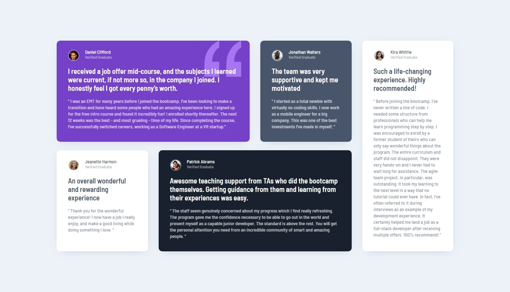

# Frontend Mentor - Testimonials grid section solution

This is a solution to the [Testimonials grid section challenge on Frontend Mentor](https://www.frontendmentor.io/challenges/testimonials-grid-section-Nnw6J7Un7). Frontend Mentor challenges help you improve your coding skills by building realistic projects.

## Table of contents

- [Overview](#overview)
  - [The challenge](#the-challenge)
  - [Screenshot](#screenshot)
  - [Links](#links)
- [My process](#my-process)
  - [Built with](#built-with)
  - [What I learned](#what-i-learned)

## Overview

### The challenge

Users should be able to:

- View the optimal layout for the site depending on their device's screen size

### Screenshot

#### Mobile

#### Desktop

### Links

- [Solution URL](https://www.frontendmentor.io/solutions/responsive-grid-of-cards-in-different-sizes-teLeqziQRk)
- [Live Site URL](https://jvmdo.github.io/frontend-mentor-challenges/testimonials-grid-section/)

## My process

### Built with

- Semantic HTML5 markup
- CSS3
- Grid

### What I learned

- All the others challenges I completed so far, I had set the paragraph's `font-size` directly in each paragraphs. I realized it's more useful set the size in `body`, then to use `em` unit to change specific font sizes whilst also using `rem`.

- `clamp()` can be a great way to set a variable font-size between a maximum and minimum bounders.

- Use only one `header` and `main` in the entire document. Repeat `section` or `article` instead.
